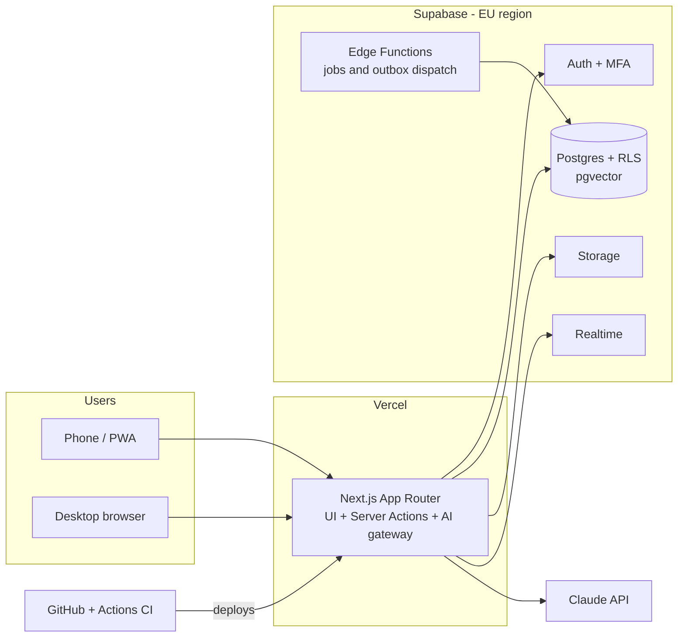
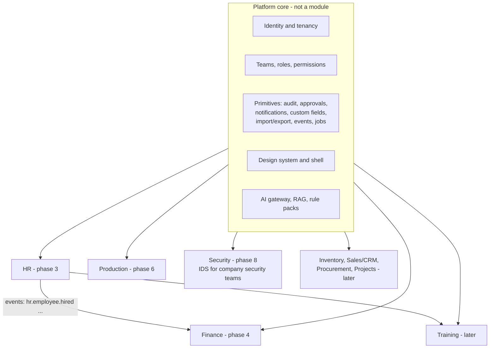

# 00 — Overview

**Modular ERP** (working title) is a mobile-first, AI-native web application that manages a company from start to finish: HR, Finance, Production, Training, and later Inventory, Sales/CRM, Procurement and Projects. One deployment hosts many companies; each company enables the modules it needs, organizes people into teams with granular role-based permissions, and gets an AI layer that analyses its data and keeps it compliant with its country's legislation.

Launch market: **Portugal** (PT primary, EN secondary). Demo stack: **GitHub + Vercel + Supabase**.

## Vision

- **One app instead of five.** Small and mid-size companies juggle disconnected tools for HR, invoicing and production. Here every module shares the same people, teams, permissions, audit trail and design language.
- **Mobile first, really.** The phone is the primary device: approving an absence, snapping an invoice, closing a work order on the shop floor. Desktop is the enhancement.
- **AI-native with guardrails.** The assistant answers questions from company data (with the asker's permissions, never more), navigates users to the right screen using the manual, and drafts compliance updates from legislation — but **AI proposes, humans approve**, always audited.
- **Legislation as data.** Country rules (tax, payroll, invoicing mandates) live in versioned, cited **rule packs**, not in code. Adding a country is adding data.

## Personas

| Persona | App role | Company role (example) | What they do here |
|---|---|---|---|
| Sofia | `platform_admin` | — | Operates the platform: tenants, plans, health. Zero access to company business data. |
| Carlos | `user` | Owner (all permissions, company scope) | Runs his 40-person manufacturing company; watches dashboards. |
| Marta | `user` | HR Manager (hr.\*, team/company scope) | Contracts, absences, salaries; asks the AI about turnover and vacation liabilities. |
| Miguel | `user` | Accountant (finance.\*) | Invoices, expenses, approvals; the AI pre-fills entries from photographed receipts. |
| João | `user` | Supervisor (production.\* team scope, absence approvals for his team) | Runs a shift from his phone on the shop floor, sometimes offline. |
| Rita | `user` | Employee (own-scope basics) | Requests absences, checks payslips, updates her personal profile. |

## System context

Everything user-facing goes through the Next.js app. The database is the security boundary: every tenant table carries `company_id` and an RLS policy resolved through the permission function ([03-permissions.md](03-permissions.md)). The AI gateway calls Claude server-side and executes data tools **as the requesting user** ([06-ai-platform.md](06-ai-platform.md)).

## Module map

Modules are plug-ins on a stable core: each declares routes, navigation, permission catalog entries, migrations, events, jobs and a manual chapter ([04-module-system.md](04-module-system.md)). Modules never import each other's internals — they react to events.

## Guiding principles (from CLAUDE.md — binding)

1. Docs move with code — manual + roadmap updated in the same PR.
2. Security lives in the database — RLS on every tenant table.
3. AI proposes, humans approve — always as the user, always audited.
4. Mobile first — design at 390 px.
5. i18n from day 1 — PT + EN, country logic only in rule packs.
6. Modules are plug-ins — event-driven integration only.
7. One design system — tokens and shared components everywhere; light + dark.

## Document index

| Doc | Contents |
|---|---|
| [01-tech-stack.md](01-tech-stack.md) | Stack choices and why, environments, CI/CD |
| [02-tenancy-and-identity.md](02-tenancy-and-identity.md) | Companies, users, auth + 2FA, SSO path, profiles |
| [03-permissions.md](03-permissions.md) | Two-layer permission model, RLS patterns |
| [04-module-system.md](04-module-system.md) | Module registry and contract |
| [05-data-platform.md](05-data-platform.md) | Schema conventions, events, jobs, custom fields |
| [06-ai-platform.md](06-ai-platform.md) | AI gateway, RAG, rule packs, guardrails |
| [07-security-compliance.md](07-security-compliance.md) | Threat model, GDPR, Portugal pack |
| [08-mobile-ux.md](08-mobile-ux.md) | PWA, offline, navigation shell |
| [09-design-system.md](09-design-system.md) | Tokens, components, screen patterns, themes |
| [adr/](adr/) | Decision records |
